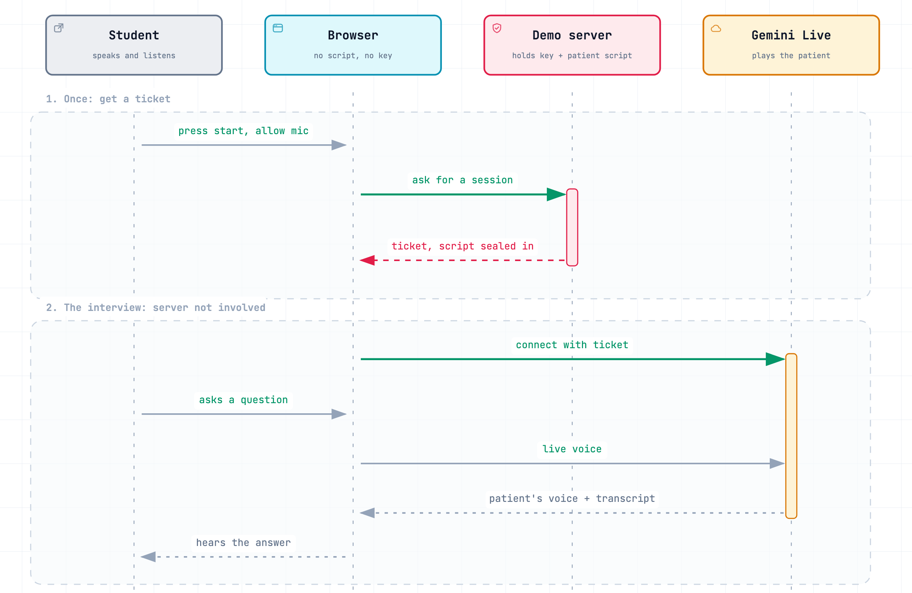

# Voice Standardized Patient

A voice AI patient for practising a clinical interview in the browser: one page, one fictional patient (Jieun Kim, 31, cannot sleep), one Gemini Live session. English by default, Korean with `?lang=ko`.

Live demo: https://sptalk-demo.web.app

## What it is for

In the clinical skills part of the Korean medical licensing exam (CPX), a student interviews a patient played by a trained actor and is scored against a checklist of what they asked. The patient answers what is asked and does not volunteer the rest. To practise, a student needs someone willing to play the patient.

This page puts one such patient in a browser tab. You press start, speak, and the patient answers out loud. There is nothing to install and no account. The demo shows that a spoken patient interview can run in an ordinary browser while the patient's script stays hidden and nothing is recorded.

## How it works

<picture>
  <source media="(prefers-color-scheme: dark)" srcset="docs/how-it-works-dark.png">
  
</picture>

A session has two steps. First the page asks the demo server for a session. The server holds the API key and the patient's script. It checks where the request came from, seals the script, the voice and the model into a single-use ticket, and returns the ticket. Then the browser connects to Gemini Live with that ticket and the interview runs between the two. The server takes no further part.

Gemini decides when the student has finished a question. It waits for 2.5 s of silence, so a student who pauses to think is not cut off. The first patient audio arrives 2.9–3.1 s after the student stops speaking (author's measurement, 2026-09, synthesized speech input); most of that is the deliberate wait.

## What the design gives you

- The student cannot read the answers. Because the patient only reveals what is asked, the script works as an answer key. It stays on the server and inside the sealed ticket. The browser can neither read it nor replace it with its own instructions.
- Nothing is recorded. Audio goes from the browser to Google, and the demo server never receives it. The transcript lives in the page and is gone on reload.
- The link stays up. The server only answers requests from the demo's own site and gives each visitor a few sessions a day, so a stranger cannot use up the API budget.

## Run locally

Requires Node 22 and a Google AI Studio key.

```
npm run install:all
cp .env.example functions/.env   # add GEMINI_API_KEY
npm run dev
```

The API runs on http://localhost:8788 with an in-memory quota; the page on http://localhost:5173 proxies `/api/demo` to it.

## Deploy

```
cp .firebaserc.example .firebaserc   # set your Firebase project id
npm run deploy
```

In `functions/.env`, `DEMO_ORIGINS` lists the sites allowed to ask for a session (localhost is always allowed). `DEMO_PER_IP` and `DEMO_PER_DAY` cap sessions per visitor and in total per day, counted in one Firestore document per day; if the counter cannot be read, the request is refused.

Hosting serves `client/dist`, `/api/**` goes to the `demo` function in `us-central1`, and Firestore holds the quota counter.

## Layout

```
client/src/demo/DemoApp.jsx   the page: intro, call, done
client/src/demo/live.js       session: token, status, errors
client/src/demo/content.js    screen text and the door note
client/src/lib/geminiLive.js  Live WebSocket transport, mic worklet, playback, utterance assembler
functions/index.js            Cloud Function export
functions/dev.js              local server with in-memory quota
functions/demo.js             the session route, origin check, quota
functions/demoCase.js         the fictional patient (English and Korean sheets)
functions/gemini.js           Live config and token minting
docs/how-it-works.*           the figure; the .json is the source (rendered with archify)
```

## Models

`gemini-3.8-live`, voice `Kore`; override the model with `GEMINI_LIVE_MODEL`.

## License

MIT. See `LICENSE`.
