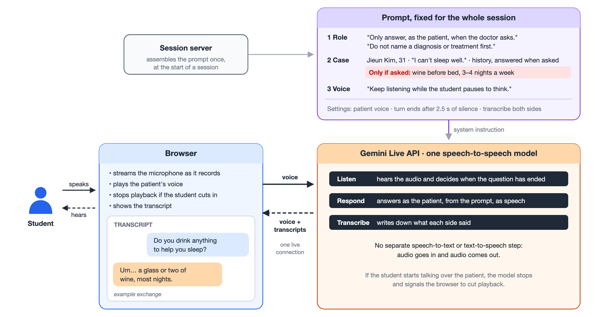

# Voice Standardized Patient

Voice Standardized Patient is a browser-based voice agent that plays a standardized patient, so that medical students can practise clinical history taking by speaking with it.

[**Live Demo**](https://sptalk-demo.web.app) (No account or API key needed. Add `?lang=ko` for Korean.)

<picture>
  <source media="(prefers-color-scheme: dark)" srcset="docs/architecture-dark.png">
  
</picture>

## Overview

In the Clinical Performance Examination (CPX) of the Korean Medical Licensing Examination, students interview a standardized patient, a trained actor who follows a case script, and are scored on which questions they ask. The patient answers only what is asked. Practising for this usually requires a second person to play the patient.

This prototype has a speech-to-speech model play the patient instead. The demo has one synthetic case: Jieun Kim, 31, who presents with insomnia.

## How it works

The browser streams microphone audio to the [Gemini Live API](https://ai.google.dev/gemini-api/docs/live) over a single WebSocket connection. A single model handles turn detection, the patient's spoken response, and transcription of both speakers. There is no separate speech-to-text or text-to-speech step.

The patient is defined by a system prompt with three parts: role instructions, the case sheet, and rules for voice conversation. Some facts in the case sheet are revealed only when the student asks about them directly, such as alcohol use before bed. The server locks this prompt, the model, and the voice into a single-use ephemeral token. The browser therefore cannot read the case sheet or change the instructions.

A turn ends after 2.5 s of silence, so students can pause while forming a question. Latency from the end of the student's speech to the first patient audio was 2.9–3.1 s in our measurements (September 2026, synthesized speech input).

## Privacy

Audio goes from the browser directly to the Gemini API and does not pass through our server. The transcript is kept only in the browser and is cleared on reload. Google's handling of the audio is governed by the Gemini API terms.

## Development

Requires Node.js 22 and a [Google AI Studio](https://aistudio.google.com/) API key.

```bash
npm run install:all
cp .env.example functions/.env   # set GEMINI_API_KEY
npm run dev                      # http://localhost:5173
```

The case is defined in `functions/demoCase.js` and the session configuration in `functions/gemini.js`. The architecture figure is generated from `docs/architecture.html`.

## License

MIT
