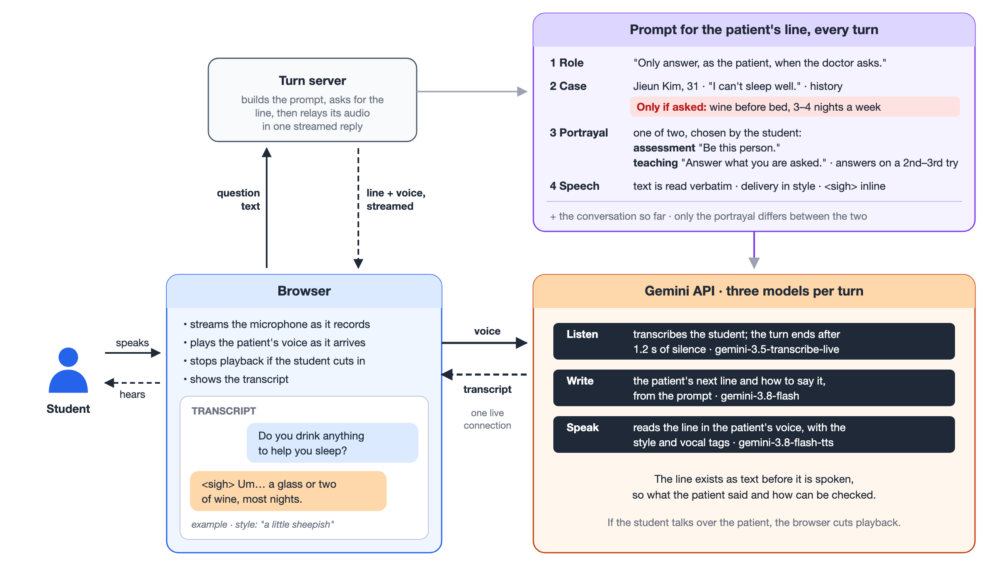

# Voice Standardized Patient

Voice Standardized Patient is a browser-based voice agent that plays a standardized patient, so that medical students can practise clinical history taking by speaking with it.

[**Live Demo**](https://sptalk-demo.web.app) (No account or API key needed. Add `?lang=ko` for Korean.)

<picture>
  <source media="(prefers-color-scheme: dark)" srcset="docs/architecture-dark.png">
  
</picture>

## Overview

In the Clinical Performance Examination (CPX) of the Korean Medical Licensing Examination, students interview a standardized patient, a trained actor who follows a case script, and are scored on which questions they ask. The patient answers only what is asked. Practising for this usually requires a second person to play the patient.

This prototype has a voice agent play the patient instead. The demo has one synthetic case: Jieun Kim, 31, who presents with insomnia.

The same patient can be played two ways, and the visitor picks one before the interview:

- **Assessment standardized patient** (`assessment`). Acts like a standardized patient in the exam room, as close to a real patient as possible. She may bring things up before being asked.
- **Teaching patient** (`teaching`). A practice partner. Answers what is asked, gives in when the student comes back to a topic two or three times, and says more after empathy or open questions.

Everything else is identical: case sheet, models, voice, and per-turn rules. Only one block of the prompt changes (`functions/portrayals.js`).

## How it works

Each turn uses three Gemini models:

1. **Listen.** The browser streams microphone audio to a transcription-only [Gemini Live](https://ai.google.dev/gemini-api/docs/live) session (`gemini-3.5-transcribe-live`). The student's turn ends after 1.2 s of silence. If the student pauses longer and goes on before the patient has made a sound, the two fragments are answered as one question.
2. **Write.** The server asks `gemini-3.8-flash` for the patient's next line and a short delivery direction, from a prompt built from the role, the case sheet, the chosen portrayal, and the conversation so far. Some facts in the case sheet are given only when the student asks directly, such as alcohol use before bed.
3. **Speak.** The server has `gemini-3.8-flash-tts` read the line and streams the audio back in the same reply. Following the [Gemini 3.8 TTS guide](https://ai.google.dev/gemini-api/docs/speech-generation), the line is a verbatim transcript, the delivery goes in `speech_metadata.style` (empty on most turns), and momentary sounds are inline tags such as `<sigh>` or `<short pause>`.

Because the line exists as text before it is spoken, what the patient said and how it was said can be logged and checked. If the student starts talking over the patient, the browser stops playback and drops that turn.

The case sheet and the portrayal texts stay on the server. The transcription token locks its configuration, so the browser cannot turn it into a general session.

Latency from the end of the student's speech to the first patient audio was about 2.7–3.4 s after the 1.2 s silence (September 2026, measured from a browser page). Firebase Hosting buffers a rewritten response until it is complete, which delayed the audio to 8–14 s; set `VITE_API_BASE` to the function URL so the browser streams from the function directly.

## Privacy

Microphone audio goes from the browser directly to the Gemini API for transcription. The question text and the patient's audio pass through the server and are not stored. The transcript is kept only in the browser and is cleared on reload. Google's handling of the audio is governed by the Gemini API terms.

## Development

Requires Node.js 22 and a [Google AI Studio](https://aistudio.google.com/) API key.

```bash
npm run install:all
cp .env.example functions/.env   # set GEMINI_API_KEY
npm run dev                      # http://localhost:5173
```

The case is defined in `functions/demoCase.js`, the two portrayals in `functions/portrayals.js`, and the per-turn rules and models in `functions/tts.js`. The architecture figure is generated from `docs/architecture.html`.

## License

MIT
